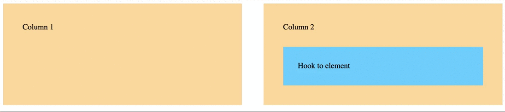

# jQuery.HookTo

Hook To - jQuery plugin

Move an HTML element on specific screen size with dynamic back-in-place.

Example here : [hookto codepen](https://codepen.io/AxelBaron/pen/JjPJoPa)

## Install

### NPM
Install jQuery first, then run :
`npm install jquery.hookto`

### Manualy 
Install jQuery first, then jquery.hookto :
```
<script src="jquery.min.js"></script>
<script src="jquery.hookto.js"></script>
```

## How to
* Add ``data-hook-to=""`` attribute to your element.
* Create HTML a traget.

Example :
```HTMl
<div class="my-element-to-move" 
     data-hook-to="#link-to-target">
</div>
<div class="toto">
    <meta id="target"/>
</div>
```
In this case, my HTML element ``class="my-element-to-move"`` will be insert just after the HTML element ``<meta id="target">``.


### Settings

#### HTML attributes method

```HTMl
<div 
  data-hook-to-mobile-first="true"
  data-hook-to="#hook-destination" 
  data-hook-to-position="after" 
  data-hook-to-return="768"
  data-hook-to-origin-prefix="hookto-orig"></div>
```

#### jQuery method
You can overwrite default values with javascript :
```javascript
$('.my-element').hookTo(destinationHook, options);
```

```js
var options = {
  'hookOriginPrefix': 'hookto-orig',
  'position': 'after',
  'returnAt': '768',
  'mobileFirst': true
}
```

#### Callback methods
In jQuery, you can add some actions using this callbacks methods.
```js
$('.my-element').hookTo(destinationHook, {
   'onInit': function () {},
   'onHook': function () {},
   'onUnhook': function () {}
});
```

### All attributes
 
 Propriety | Type | Default | Description
 --------- | ---- | ------- | -----------  
 data-hook-to-mobile-first | Boolean | true | The element will be move if screen size is > of the breakpoint. ( false, < of the breakpoint )
 data-hook-to | HTML element | - | An HTML element. Put ``#`` if is an ID, ``.`` if is a class.
 data-hook-to-position | String | after | Put the element just after. ( you can use "before", or "inside" instead)
 data-hook-to-return | Number | 768 | Breakpoint. Move the element only after with window size
 data-hook-to-origin-prefix | String | hookto-orig | Breakpoint. Move the element only after with window size.

